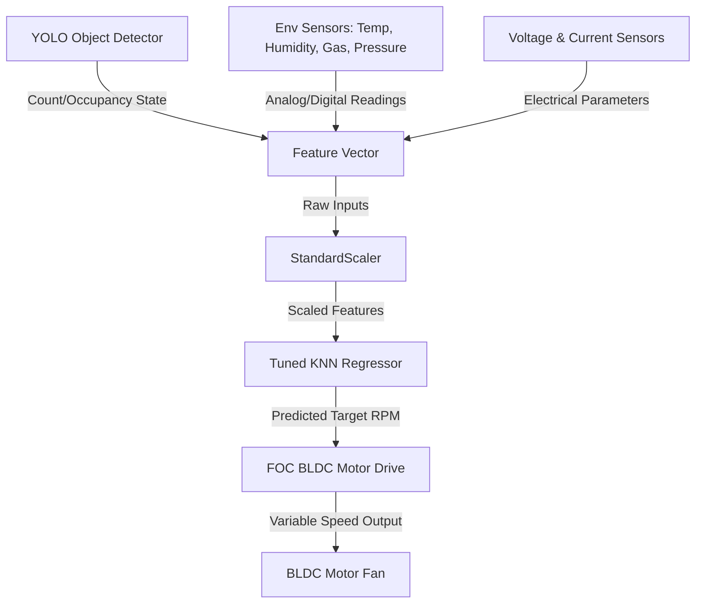

# FOC-Based BLDC Motor Speed Prediction Drive for Shopping Malls

This repository contains the intelligence and prediction framework for a Field-Oriented Control (FOC) based BLDC (Brushless DC) motor drive designed for public complexes, such as shopping malls. The system automatically adjusts the HVAC fan/motor speed according to environmental conditions and occupancy.

---

## 🎯 Project Aim & Concept

In large public spaces like shopping malls, energy consumption from air circulation and HVAC systems is extremely high. This project aims to optimize energy usage and maintain comfort levels by dynamically regulating a BLDC motor drive using a dual-AI approach:

1. **Occupancy Detection (YOLO)**: A computer vision camera stream uses a YOLO (You Only Look Once) model to monitor the complex and detect human occupancy (density/count), determining whether the area is active or empty.
2. **Dynamic Speed Prediction (KNN Regression)**: A K-Nearest Neighbors (KNN) model takes real-time readings—Occupancy, Temperature, Humidity, Pressure, Gas Levels, and feed-forward Voltage/Current—to predict the optimal fan/motor speed in RPM.
3. **Efficient Motor Drive (FOC)**: Field-Oriented Control (FOC) is utilized to drive the BLDC motor at the predicted RPM. FOC ensures high efficiency, low noise, smooth torque, and reduced power losses compared to traditional scalar control methods.

---

## 🛠️ System Architecture



---

## 📁 Repository Structure

* [BLDC_KNN_Dataset.xlsx](file:///c:/rishwan/Projects/foc_speed_prediction/BLDC_KNN_Dataset.xlsx): The Excel dataset containing training parameters and their corresponding actual motor speed (RPM).
* [train_knn.py](file:///c:/rishwan/Projects/foc_speed_prediction/train_knn.py): Script to load dataset, split data, apply `StandardScaler`, perform Grid Search optimization for hyperparameter tuning (`n_neighbors`, distance metrics, weights), evaluate the model, and save checkpoints.
* [predict.py](file:///c:/rishwan/Projects/foc_speed_prediction/predict.py): Command Line Interface (CLI) and interactive program that uses the trained scaler and model to predict the motor RPM for any given environment scenario.
* [knn_model.joblib](file:///c:/rishwan/Projects/foc_speed_prediction/knn_model.joblib): Saved KNeighborsRegressor model checkpoint.
* [scaler.joblib](file:///c:/rishwan/Projects/foc_speed_prediction/scaler.joblib): Saved StandardScaler object checkpoint.
* [knn_performance.png](file:///c:/rishwan/Projects/foc_speed_prediction/knn_performance.png): Saved matplotlib plot comparing the actual vs. predicted fan speed (RPM) for evaluation.

---

## ⚙️ Setup & Installation

Ensure you have Python installed, then install the required dependencies:

```bash
pip install pandas numpy scikit-learn openpyxl matplotlib seaborn joblib
```

---

## 🚀 Running the Project

### 1. Training the KNN Model

To train the KNN model and optimize hyperparameters using cross-validation:

```bash
python train_knn.py
```

This script will:
* Load the Excel dataset.
* Tune hyperparameters using GridSearchCV.
* Report evaluation metrics: R² score, Mean Absolute Error (MAE), and Root Mean Squared Error (RMSE).
* Save the trained model to [knn_model.joblib](file:///c:/rishwan/Projects/foc_speed_prediction/knn_model.joblib) and scaler to [scaler.joblib](file:///c:/rishwan/Projects/foc_speed_prediction/scaler.joblib).
* Generate and save a prediction validation plot to [knn_performance.png](file:///c:/rishwan/Projects/foc_speed_prediction/knn_performance.png).

### 2. Predict Motor Speed (RPM)

You can run predictions on new sensor values using the [predict.py](file:///c:/rishwan/Projects/foc_speed_prediction/predict.py) script in three different modes:

#### A. Interactive Mode (Prompt-based Inputs)
Input the values through terminal prompts:
```bash
python predict.py --interactive
```

#### B. Command Line Argument Mode
Provide all features directly in the command line:
```bash
python predict.py --temp 32.5 --humidity 45.0 --gas 110.0 --pressure 1013.25 --occupancy 1.0 --voltage 12.0 --current 2.5
```

#### C. Sample Prediction (Default Demo)
Run without any argument to execute using default pre-configured test parameters:
```bash
python predict.py
```

---

## 📊 Features & Model Inputs

The KNN model expects the following features in order:

| Feature Name | Description | Unit |
| :--- | :--- | :--- |
| `Temperature_C` | Ambient complex temperature | Degrees Celsius (°C) |
| `Humidity_percent` | Ambient humidity levels | Percentage (%) |
| `Gas_ppm` | Gas concentration in the environment | Parts Per Million (ppm) |
| `Pressure_hPa` | Barometric atmospheric pressure | Hectopascals (hPa) |
| `Occupancy` | YOLO human occupancy detection indicator | 0.0 (Unoccupied) / 1.0 (Occupied) |
| `Voltage_V` | Motor feed-forward voltage sensor reading | Volts (V) |
| `Current_A` | Motor feed-forward current sensor reading | Amperes (A) |

**Target Output:** `MotorSpeed_RPM` — Predicted target rotational speed for the BLDC motor controller.
